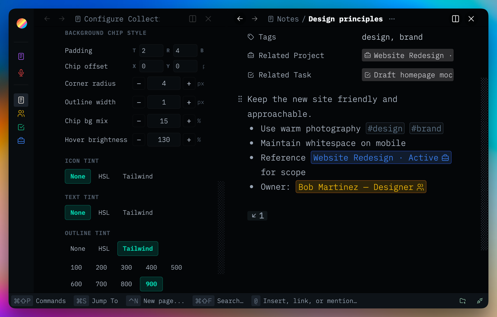

# Collection Icons

Global Thymer plugin that decorates inline editor links with the linked
collection or page icon.

Plugins are made with 🤍 for the Thymer community. Free to use, fork, and hack on for <a href="LICENSE" target="_blank" rel="noopener noreferrer">non-commercial use</a>.

Plug-ins take effort, hours, and credits to build. If you find them helpful for you and your workflows, a star ⭐ on the repo, a <a href="https://buymeacoffee.com/akaready" target="_blank" rel="noopener noreferrer">coffee</a> ☕, and a link back to <a href="https://akaready.com" target="_blank" rel="noopener noreferrer">@akaready</a> 🔗 all go a long way. Optional of course, but always appreciated.

Enjoy! 🙏

  

&nbsp;

## 📦 Install

**Recommended:** Use the [Thymer Plugins Manager](https://github.com/ahpatel/thymer-plugins-manager) and install via [this repo's URL](https://github.com/akaready/thymer-collection-icons) for auto updates.

**Manual:** copy <a href="plugin.js" target="_blank" rel="noopener noreferrer"><code>plugin.js</code></a> and <a href="plugin.json" target="_blank" rel="noopener noreferrer"><code>plugin.json</code></a> from this repo into Thymer's plugin editor.

&nbsp;

## ✨ What It Does

- Adds a settings panel: **Plugin: Collection Icons**.
- Replaces Thymer's trailing inline-link arrow with the linked record/page icon.
- Uses the linked record/page icon when available, falling back to its
  collection icon.
- Can show the native arrow instead, hide it, or suppress the open-in-other-panel hover action.
- Supports native hover underline, underline-on-hover, and no-underline styles.
- Supports icon-only or icon+text color targeting, text chip background/outline,
  neutral padding controls, chip shape presets, and collection color integration.

&nbsp;

## ⚙️ How It Works

The SDK does not expose a render hook for inline editor link segments, so this
plugin uses a narrow `MutationObserver` on the active editor panel.

For each inline reference it:

- finds the leaf `data-guid` element that represents the inline link;
- tags it with stable plugin attributes instead of replacing editor row text;
- replaces the native trailing arrow glyph in-place with the linked icon;
- writes CSS variables and mode attributes used by the stylesheet;
- reads Collection Colors synced JSON/local cache when color tinting is enabled.

Synced settings live in `plugin.json` under `custom.settings`. Local storage is
kept as a workspace-scoped fast override/cache:

- `collection-icons/<workspaceGuid>/settings`
- `collection-colors/<workspaceGuid>/colors` is read only, if present

Collection Colors' `custom.colors` JSON is preferred on clients where local
storage is empty, such as mobile PWA installs.

&nbsp;

## 📝 Important Implementation Notes

- Avoid full redraws while the user is typing. The plugin keeps the inline
  decoration stable and updates attributes/styles narrowly.
- The shape preset buttons update several chip defaults together so rounded,
  square, and circle modes produce coherent geometry.
- Hover effects are scoped to the linked collection element only, not the whole
  editor row.
- The plugin strips legacy prefix spans on load so older buggy versions do not
  leave duplicate decoration behind.

&nbsp;

## 📊 Anonymous Usage Counter

This plugin pings a <a href="https://www.goatcounter.com/" target="_blank" rel="noopener noreferrer">privacy-respecting counter</a> on first install and once per day of active use. It exists so I can see which plugins are worth continuing to invest in — both "did anyone install it" and "is anyone still using it after a week." Combined with the coffee donations, this is what tells me whether to keep building. It tracks the plugin slug only, no other telemetry or user data, and you can see exactly what I see on the <a href="https://thymer-plugins.goatcounter.com" target="_blank" rel="noopener noreferrer">public dashboard</a>.

**Opt out:** Do Not Track, or `localStorage.setItem('tps-telemetry-opt-out','1')` in the console.
